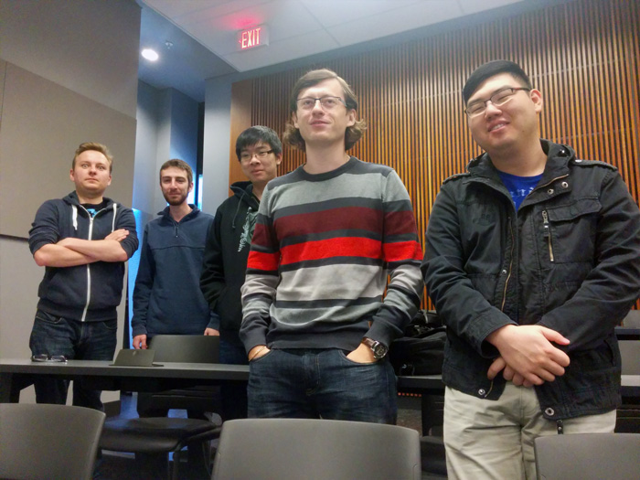

Proj-UTM-Team2-repo
===================

## Biographies

### Alex

Fourth Year university student currently double majoring in Computer Science and Communication, Culture and Information Technology.  

### Anton

4th year Coputer Science Specialist student who likes to program in Java using NetBeans.

### Jonathan

Fourth Year UofT student doing a double major in Comp Sci and Mathematics.

### Jonny

Hi, Fourth Year Computer Science Speicalist student. Nothing fancy, I live on campus, always glad to help.

### Vlad

Fourth Year CS Student. I use IntelliJ IDEA 13 to write my Java Code, I also live in Toronto. 
